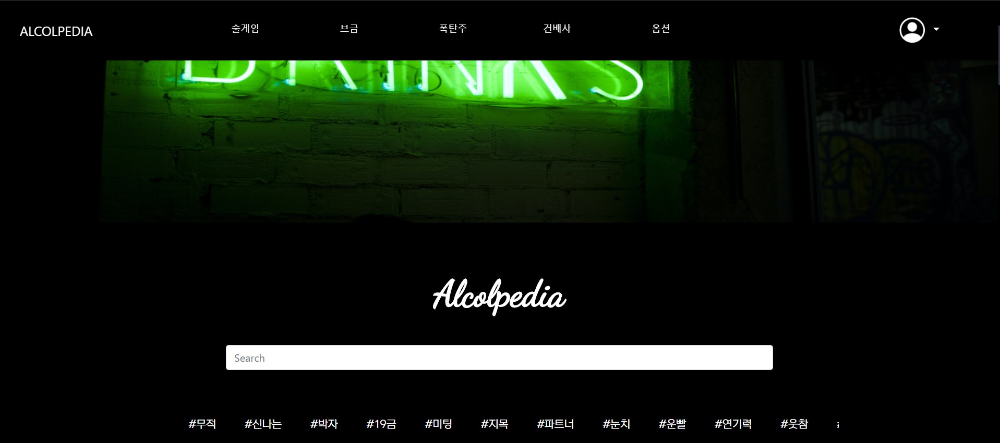

<h1 align = "center" >Alcolpedia</h1>

 
    
    
    
    
    
    
    

<a href = "http://www.alcolpedia.com"> <h2 align = "center"> Explore Alcolpedia </h2> </a>

## Description

alcolpedia is a django website to introduce various drinking cultures in Korea

## Developers
| username | name |
|--|--|
| [rlwjd4177](https://github.com/rlwjd4177) | 이기정 | 
| [ekdls13](https://github.com/ekdls13)  | 홍다인 |
| [shinkeonkim](https://github.com/shinkeonkim) | 김신건 |
| [Chungjiyoon](https://github.com/Chungjiyoon) | 정지윤 |

## LICENSE
